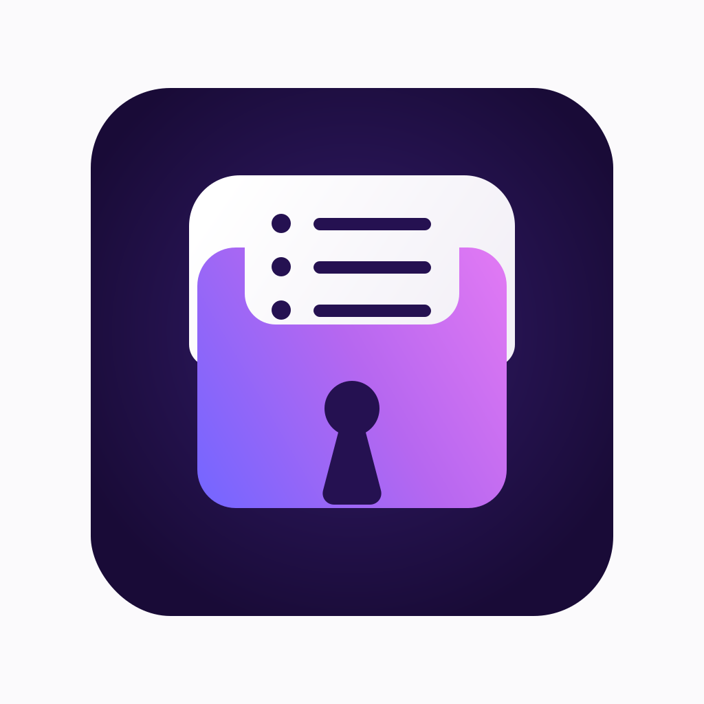

<p align="center">
  
</p>

# Load Secrets from Proton Pass

A GitHub Action that loads secrets from [Proton Pass](https://proton.me/pass) vaults into your GitHub Actions workflows using `pass://` URI references.

Works like [1Password's load-secrets-action](https://github.com/1password/load-secrets-action), but backed by Proton Pass.

## Quick Start

```yaml
- name: Load secrets
  uses: gizmodlabs/load-secrets-proton-pass@v1
  with:
    personal-access-token: ${{ secrets.PROTON_PASS_PERSONAL_ACCESS_TOKEN }}
  env:
    DATABASE_URL: "pass://Production/Database/connection_string"
    STRIPE_KEY: "pass://Production/Stripe/secret_key"

- name: Deploy
  run: ./deploy.sh   # DATABASE_URL and STRIPE_KEY are in env
```

Each `pass://vault/item/field` value is replaced with the real secret and exported as a regular environment variable for every subsequent step in the job.

## Setup

### 1. Prerequisites

- A [Proton Pass Plus+](https://proton.me/pass) subscription (required for CLI access)
- The [Proton Pass CLI](https://proton.me/support/pass-cli) installed locally (you only need it on your own machine to mint the token — the action installs it on the runner automatically)

### 2. Generate a Personal Access Token

Log in to `pass-cli` on your local machine, then create a scoped, expiring token for CI:

```bash
# Create a named token (90-day expiration in this example)
pass-cli pat create --name "github-actions" --expiration 90d

# Grant it read-only access to each vault it should be able to see.
# IMPORTANT: `pat create` alone gives the token zero vault access — you must
# run this grant for every vault the action needs to read from.
pass-cli pat access grant --pat-name "github-actions" --vault-name "Production" --role viewer
```

The `create` command prints the token in the format `pst_xxxx::TOKENKEY`. **Copy it now — it is shown only once.**

Token tips:
- Scope per-vault with `--role viewer` so the token can read but never write.
- Use short expirations (`30d`, `90d`) and rotate.
- Revoke any time with `pass-cli pat delete --name "github-actions"`.

### 3. Add the GitHub secret

In your repository, go to **Settings → Secrets and variables → Actions** and add:

| GitHub Secret | Description |
|---|---|
| `PROTON_PASS_PERSONAL_ACCESS_TOKEN` | The full `pst_xxxx::TOKENKEY` value from step 2 |

### 4. Reference secrets with `pass://` URIs

Define each secret as an environment variable on the action step using a `pass://` URI:

```
pass://vault-name/item-name/field-name
```

- **vault-name** — name of the Proton Pass vault
- **item-name** — name of the item in the vault
- **field-name** — `password`, `username`, or any custom field name

## Usage

### Environment variables (default)

Every `pass://` env var on the action step is resolved and re-exported as a regular env var available to all subsequent steps in the same job:

```yaml
- name: Load secrets
  uses: gizmodlabs/load-secrets-proton-pass@v1
  with:
    personal-access-token: ${{ secrets.PROTON_PASS_PERSONAL_ACCESS_TOKEN }}
  env:
    DB_PASSWORD: "pass://Production/Database/password"

- name: Run migrations
  run: ./migrate.sh   # DB_PASSWORD is in env
```

### Bulk-load every field on an item (glob URIs)

When an item carries several related fields (a database item with `host`, `port`, `password`, `database_name`), use `*` in the field segment to pull all of them with one entry:

```yaml
- name: Load secrets
  uses: gizmodlabs/load-secrets-proton-pass@v1
  with:
    personal-access-token: ${{ secrets.PROTON_PASS_PERSONAL_ACCESS_TOKEN }}
  env:
    DB: "pass://Production/Database/*"

- name: Connect
  run: psql -h "$DB_HOST" -p "$DB_PORT" -U "$DB_USERNAME"
```

The env-var name on the left becomes the prefix. Each field is exported as `<PREFIX>_<FIELD>`, where `<FIELD>` is sanitized: non-alphanumeric characters collapse to `_`, leading/trailing `_` is trimmed, and the result is uppercased. `api-key` and `API Key` both become `API_KEY`.

Restrictions:
- Wildcards are only valid in the **field** segment. `pass://Vault/*/field` and `pass://*/item/field` are rejected.
- An item with zero fields fails the step — empty matches are always errors.
- Two field names that sanitize to the same suffix (e.g. `api-key` and `api_key`) fail the step with both raw names listed. Rename the field or use explicit `pass://` URIs.
- Adding a new field to a globbed item adds a new env var on the next run. Keep that in mind when sharing vaults across workflows.

### Template file injection

For applications that read a `.env` file, render one from a template with `{{ pass://vault/item/field }}` placeholders:

```yaml
- name: Render .env from template
  uses: gizmodlabs/load-secrets-proton-pass@v1
  with:
    personal-access-token: ${{ secrets.PROTON_PASS_PERSONAL_ACCESS_TOKEN }}
    env-template: ".env.production.template"
```

Template (`.env.production.template`):
```
DB_HOST=db.example.com
DB_PASSWORD={{ pass://Production/Database/password }}
REDIS_URL={{ pass://Production/Redis/url }}
```

Output (`.env.production`):
```
DB_HOST=db.example.com
DB_PASSWORD=actual-resolved-password
REDIS_URL=redis://actual-url:6379
```

With an explicit output path:

```yaml
- name: Render .env from template with custom output
  uses: gizmodlabs/load-secrets-proton-pass@v1
  with:
    personal-access-token: ${{ secrets.PROTON_PASS_PERSONAL_ACCESS_TOKEN }}
    env-template: ".env.production.template"
    output-path: ".env.production"
```

## Inputs

| Input | Required | Default | Description |
|-------|----------|---------|-------------|
| `personal-access-token` | Yes | | Proton Pass PAT (`pst_xxxx::TOKENKEY`) |
| `env-template` | No | `''` | Path to a template file with `pass://` references |
| `pass-cli-version` | No | `2.1.0` | Pinned for reproducibility. Override with `latest` or any version listed at [proton.me/download/pass-cli/versions.json](https://proton.me/download/pass-cli/versions.json) |
| `mask-values` | No | `true` | Mask resolved values in workflow logs |
| `output-path` | No | `''` | Where to write the rendered template. Defaults to stripping `.template`/`.tpl`, else `<input>.resolved`. |

## Examples

Ready-to-copy workflow files live in [`examples/`](examples/):

| Example | Description |
|---------|-------------|
| [`with-pat.yml`](examples/with-pat.yml) | Generate a PAT locally, load one secret in CI |
| [`basic-usage.yml`](examples/basic-usage.yml) | Load a couple of secrets and use them |
| [`multi-service.yml`](examples/multi-service.yml) | Load secrets for multiple services in one step |
| [`env-template.yml`](examples/env-template.yml) | Inject secrets into a `.env` template file |

## Local development

The action is bash on top of `pass-cli`. Three commands cover the local loop:

```bash
# 1. Lint
shellcheck scripts/*.sh tests/*.sh

# 2. Unit tests against the mock pass-cli (no Proton account needed)
bash tests/run-local-tests.sh

# 3. Full workflow simulation using the official GitHub Actions runner
npx @redwoodjs/agent-ci run --workflow tests/test-workflow.yml
```

[`agent-ci`](https://agent-ci.dev) wraps the official `actions/runner` binary, so what passes locally is what runs in CI.

### Smoke test against a real vault

`tests/test-real.yml` (gitignored) runs the action end-to-end against your own Proton Pass account. Set up:

```bash
# 1. Put your PAT in .env.agent-ci (also gitignored) — agent-ci picks up
#    secrets from this file automatically.
echo 'PROTON_PASS_PERSONAL_ACCESS_TOKEN=pst_xxxx::TOKENKEY' > .env.agent-ci

# 2. Edit the pass:// URIs in tests/test-real.yml to point at items you own.

# 3. Run it.
npx @redwoodjs/agent-ci run --workflow tests/test-real.yml
```

The workflow references the PAT as `${{ secrets.PROTON_PASS_PERSONAL_ACCESS_TOKEN }}`, so the token never lives in the YAML.

## Requirements

- A [Proton Pass Plus+](https://proton.me/pass) subscription (required for CLI access)
- The [Proton Pass CLI](https://proton.me/support/pass-cli) — installed automatically on the runner by this action; needed locally only to mint the PAT

## Project status

This is an **independent, community-maintained** GitHub Action. It is **not affiliated with, endorsed by, or sponsored by Proton AG**. "Proton" and "Proton Pass" are trademarks of Proton AG and are used here only to describe what the action talks to.

The action is a thin wrapper around Proton's public [`pass-cli`](https://proton.me/support/pass-cli) — the same binary anyone can install and run. It uses only documented commands, accesses no private APIs, bypasses no auth, and does not reuse Proton branding beyond naming the integration.

## Contributing

Open source under MIT. Contributions welcome — bug reports, fixes, docs, new examples, dependency bumps, anything.

- File issues and feature requests in the [Issues](../../issues) tab.
- Before opening a PR, run `shellcheck scripts/*.sh tests/*.sh` and `bash tests/run-local-tests.sh` locally. Both should pass.
- Keep PRs focused; one concern per branch.
- See [Local development](#local-development) for the full dev loop.

## Author

Created by [Martin](https://github.com/thisguymartin) at [Gizmodlabs LLC](https://github.com/gizmodlabs), with contributions from the community.

## License

MIT — see [LICENSE](LICENSE)
